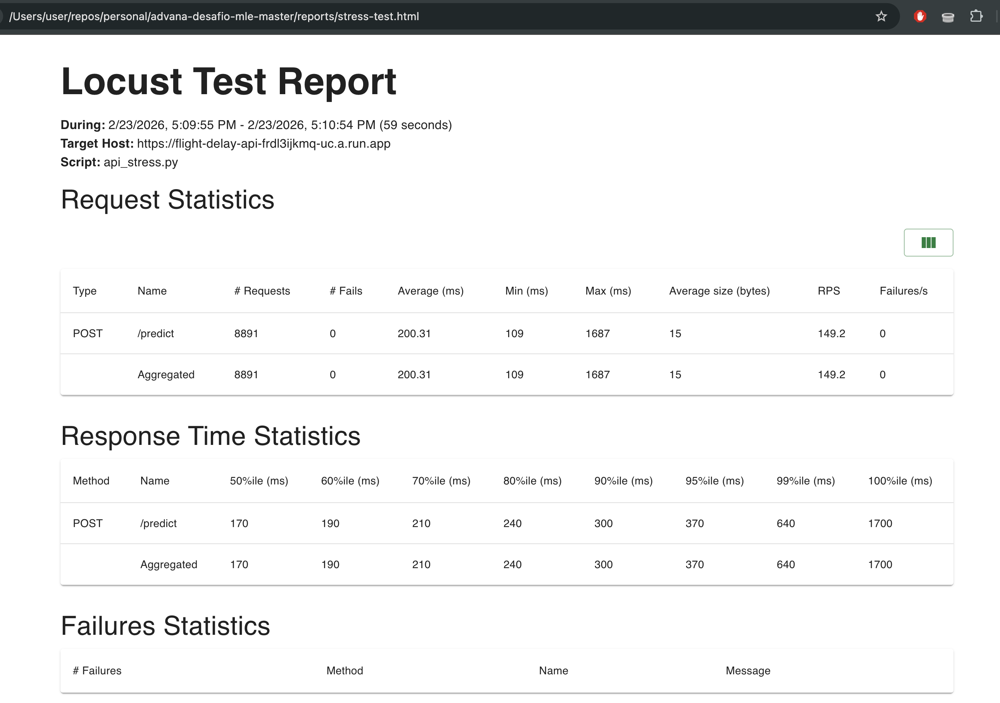
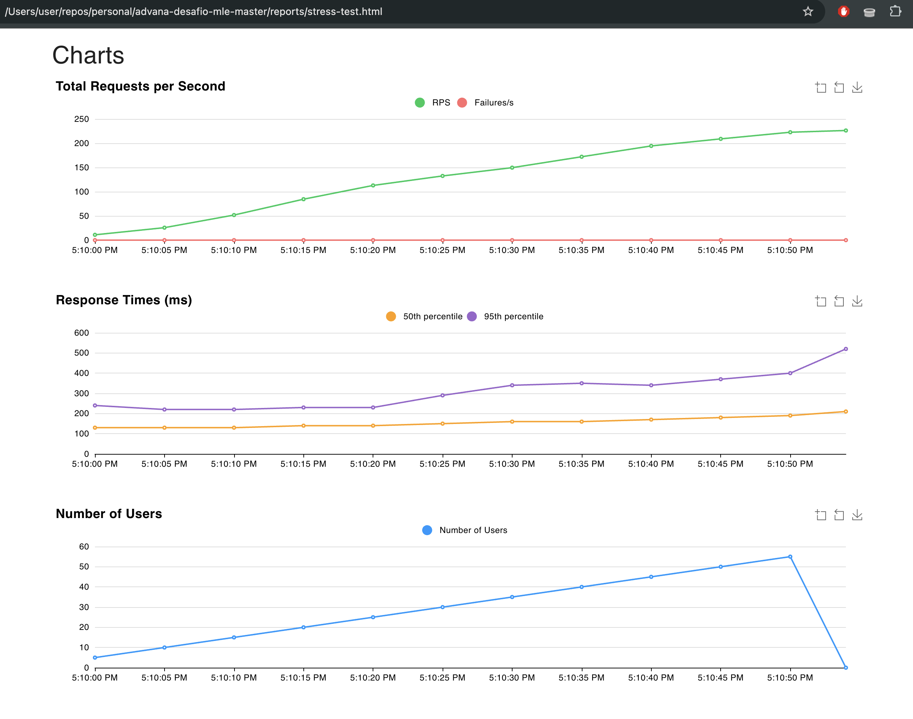
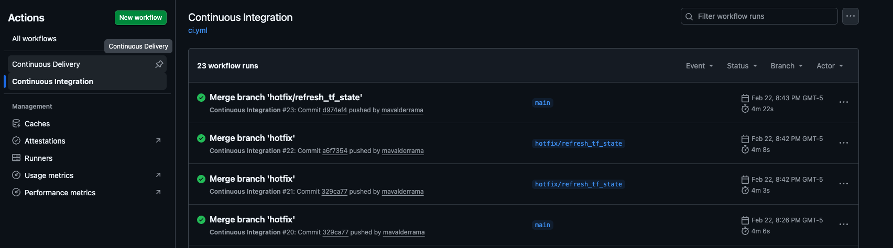
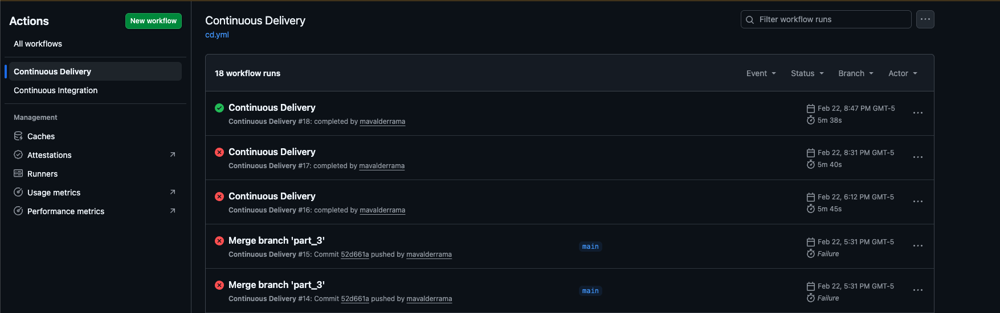
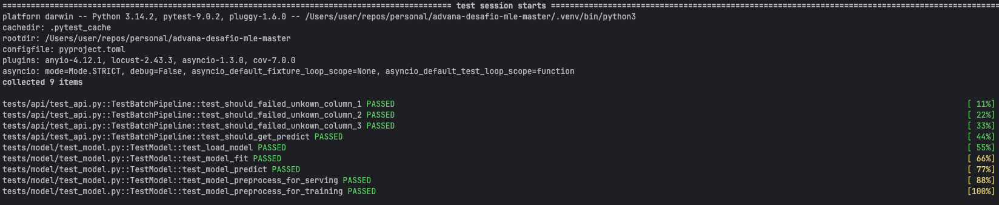

# Software Engineer (ML & LLMs) Challenge Documentation
## Part 1: Exploratory Data Analysis
### Findings
First, after looking at the DS job, I noticed some minor mistakes that could lead to wrong conclusions.
   - The `get_period_day` function was returning `None` for boundary times, the function makes use of strict inequalities `>`, instead of `>=`, so flights departing exactly at `05:00`, `12:00`, `19:00`, etc, are mapped to `NaN`, failing silently in the features set.
   - Found a small bug that on `get_rate_from_column` function causing that we weren't calculating the `Delay Rate` since the DS was doing ` total/delays` instead of `delays/total`.
   - The feature engineering looks fantastic, but it seems some features were left out unintentionally like `period_day`, `high_season`, `SIGLADES`, `DIANOM` and `DIA` on the training set, leaving them out potentially limits the model performance.
   - The top 10 features were extracted from the first `XGBoost` model, this model had a `Recall` of `0.00` for the minority class. Extracting the features from this model can be dangerous because this model will tell you only about `on-time` flights, and not about `delayed` flights.
        - There is a chance that these exact features work also for the `delayed` flights, but it is risky to assume that from this specific analysis.
   - The DS defined a prediction threshold of `0.5`, this is a common threshold for binary classification problems, but it might not be the best choice for this specific problem, due to the imbalance of the classes.
   - The DS did not perform any hyperparameter tuning, this can lead to suboptimal model performance.
      - The DS used a `learning_rate` of `0.01` but left the `n_estimators` at its default value of `100`, this can lead to underfitting.
   - At the training stage the DS didn't take into account the class imbalance; the split was done without considering the class distribution, depending on the luck the training set could contain more or less from the intended class.
      - Optionally, since the data is `temporal`, we can also make a `temporal split` training the first 8-9 months of the year, and validate on the last 3-4 months. In production a model trained today never sees data from the past.
   - Finally, the DS concludes that the balance improved the recall on class `1` but he doesn't mention that the precision is worse.

### Recommendations
- Since the model was trained entirely on categorical data, you should move away from `LogisticRegression` and try models optimized for categories like `CatBoost`, `LightGBM` or `RandomForest`.
- Apply the suggested above procedure and train again
- Once the model is trained, re-evaluate the model performance on the test set, and compare it with the previous performance. Select the best `f1` and `average precision` score.

### Model Selection
Due to the rules of this assesment/challenge I'll choose to use `LinearRegression` and by the DS conclusions, the performance difference is not noticeable, making this model the clear winner because it is simpler and easy to interpret and computationally cheaper compared with other models.

### Changes made to the code
During the development of this first part I made some changes to original provided code:
1. Fixed the `get_rate_from_column` function as explained above.
2. Fixed the `get_period_day` function as explained above.
3. Modified the `challenge/model.py` by implemented the suggested `preprocess`, `fit` and `predict` functions, also included a `dump_model` and `load` functions to handle the model persistence.
4. Included an `asyncio.to_thread` to handle model prediction in a separate thread to avoid blocking the event loop and to increase predict throughput.
5. Fixed the `tests/model/test_model.py::test_model_predict` to make it work according to the `DelayModel` class definition.
6. All required tests are passing.

## Part 2: Deploy the model in an `API` with `FastAPI` using the `api.py` file.
- This app respects the separation between the business logic and the data models, with that said, the `app/schemas.py` file contains the `Pydantic` models used to validate the input data and the `domain/models/flight.py` file contains the business logic models used pre-process the incoming request data
- Included the usage of the fastapi `lifespan` event to handle the model persistence at the startup of the app.

### Hooks and Linters
- Included the `pre-commit` hooks to run the linters and formatters before committing.
- Included the `ruff` formatter to ensure consistent code style.
- Included the `mypy` static type checker to catch type-related errors.

## Part 3: Deploy the `API` in your favorite cloud provider (we recomend to use GCP).
### Infrastructure decision
- As suggested I chose to use `GCP` for this challenge, I've decided to go with `Cloud Run` because it is a serverless solution that scales automatically based on the incoming traffic.
- Decided to go with `terraform` to automate the infrastructure provisioning.
- Defined the `Dockerfile` and `docker-compose.yml` files to build the docker image and run the app locally.
- The `Dockerfile` included the usage of `gunicorn` with `uvicorn` workers to handle the requests in a production environment.

### API Stress Test
For this part I've used the locust config provided in the Makefile.
Changed the `STRESS_URL=https://flight-delay-api-frdl3ijkmq-uc.a.run.app` to point my deployed API.




## Part 4: Deploy the `API` in production using CI/CD pipelines.
### Deployment
#### Locally
To deploy using local terraform for the very first time, you should follow the steps below:
```bash
# 1. Authenticate to your GCP account
gcloud auth login
gcloud auth application-default login
gcloud config set project YOUR_PROJECT_ID

# 2. Init Terraform with the remote state bucket
make tf-init  # or:
cd terraform && terraform init -backend-config="bucket=YOUR_TF_STATE_BUCKET"

# 3. Set your variables
cp terraform/terraform.tfvars.example terraform/terraform.tfvars
# fill in project_id (region already has a default)

# 4. Deploy
make deploy   # builds linux/amd64 image → pushes → updates Cloud Run with the new git SHA
```
#### Remote
Since this project was designed to make use of a CI/CD pipeline, you can clone the repo and push to the `main` branch to trigger the deployment pipeline automatically.
You can find the pipelines definitions at `.github/workflows/ci.yml` and `.github/workflows/cd.yml` files.
##### Continuous Integration Pipeline Working

##### Continuous Delivery Pipeline Working



## Tests
All tests are passing.

